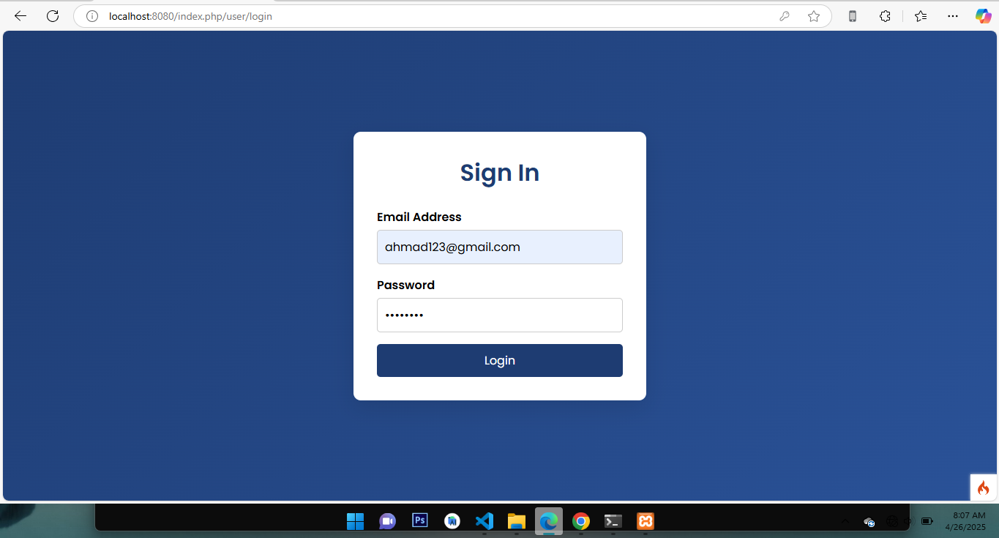
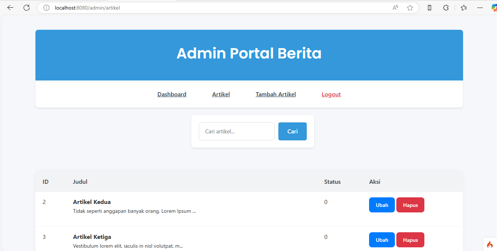
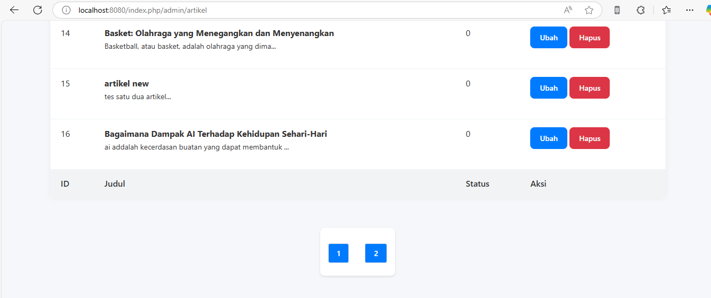
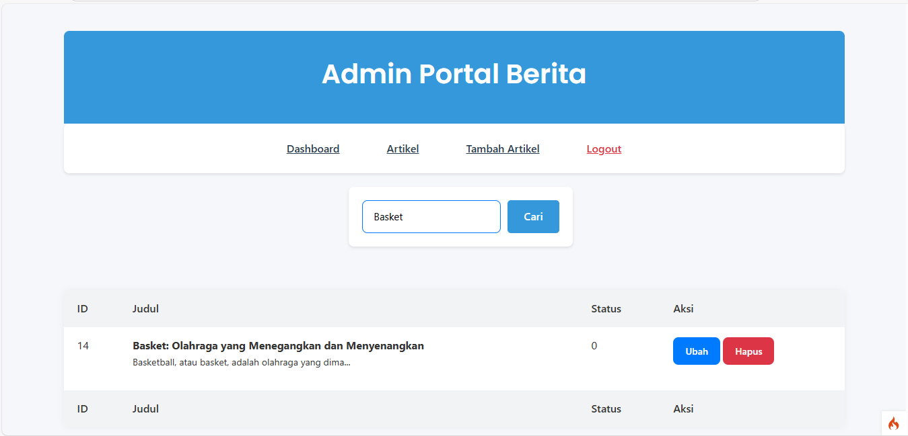

# Praktikum 4 - 6: PHP Framework (CodeIgniter 4) & MySQL
<p align="center">
 
 
 
</p>


Dokumentasi ini berisi rangkuman materi dan latihan dalam **Praktikum 4-6** dari mata kuliah **Pemorograman Web 2**.  
Setiap praktikum membahas berbagai aspek penggunaan **PHP Framework CodeIgniter 4**, mulai dari dasar hingga konsep lanjutan seperti **Sistem Login, Pagnition, Pencarian, dan Upload Gambar**.

Praktikum ini bertujuan untuk memberikan pemahaman mendalam tentang **pengembangan aplikasi web berbasis CodeIgniter 4**, termasuk konfigurasi awal, struktur proyek, serta implementasi fitur-fitur esensial dalam sebuah aplikasi web.

---

## 📚 Daftar Praktikum

Berikut ini adalah daftar praktikum yang telah diselesaikan dalam mata kuliah **Pemrograman Web 2**, dengan fokus pada penggunaan **PHP Framework CodeIgniter 4** dan **MySQL**:

| No. | Praktikum                                                                                       | Deskripsi                                                                                                                |
| --- | ----------------------------------------------------------------------------------------------- | ------------------------------------------------------------------------------------------------------------------------ |
| 1️⃣  | [Praktikum 4: Sistem Login dengan Auth & Filter](#praktikum-4---framework-lanjutan-modul-login) | Membuat sistem login menggunakan CodeIgniter 4, dengan session dan filter untuk membatasi akses ke halaman admin.        |
| 2️⃣  | [Praktikum 5: Pagination & Pencarian](#praktikum-5-pagination-dan-pencarian)                    | Mengimplementasikan pagination untuk membatasi jumlah data per halaman dan fitur pencarian untuk memfilter data artikel. |
| 3️⃣  | [Praktikum 6: Upload File Gambar](#praktikum-6-upload-file-gambar)                              | Menambahkan kemampuan unggah gambar saat membuat artikel, dan menyimpannya di direktori server.                          |

Setiap praktikum di atas didokumentasikan lengkap dengan **kode, penjelasan, serta screenshot hasilnya** untuk memperkuat pemahaman dan menjadi portofolio pengembangan web berbasis framework.

---

## 👤 Profil Mahasiswa

| Variable           | Isi                         |
| ------------------ | --------------------------- |
| **Nama**           | Ahmad Ridho Septian         |
| **NIM**            | 312310447                   |
| **Kelas**          | TI.23.A.5                   |
| **Mata Kuliah**    | Pemrograman Web 2           |
| **Dosen Pengampu** | Agung Nugroho S.kom., M.kom |

---

# Praktikum 4 - Framework Lanjutan (Modul Login)

## 🎯 Tujuan Praktikum

1. Memahami konsep dasar **Auth dan Filter**.
2. Memahami konsep dasar **Login System**.
3. Membuat modul login menggunakan **CodeIgniter 4**.

---

## 📦 Persiapan

- Pastikan XAMPP (MySQL dan Apache) sudah berjalan.
- Buka kembali folder `lab7_php_ci` dalam `htdocs`.
- Gunakan text editor seperti **VSCode**.

---

## 🛠️ Langkah-Langkah Praktikum

### 1. Membuat Tabel `user`

Buat tabel dengan struktur berikut:

```sql
CREATE TABLE user (
  id INT(11) AUTO_INCREMENT,
  username VARCHAR(200) NOT NULL,
  useremail VARCHAR(200),
  userpassword VARCHAR(200),
  PRIMARY KEY(id)
);
```

🖼️ _Screenshot hasil pembuatan tabel di phpMyAdmin:_  


---

### 2. Membuat Model `UserModel`

Lokasi: `app/Models/UserModel.php`

```php
namespace App\Models;
use CodeIgniter\Model;

class UserModel extends Model {
    protected $table = 'user';
    protected $primaryKey = 'id';
    protected $useAutoIncrement = true;
    protected $allowedFields = ['username', 'useremail', 'userpassword'];
}
```

---

### 3. Membuat Controller `User`

Lokasi: `app/Controllers/User.php`

Berisi method `index()`, `login()`, dan `logout()` untuk proses login dan logout user.

🖼️ _Screenshot kode controller:_  


---

### 4. Membuat View Login

Lokasi: `app/Views/user/login.php`

Gunakan form login dengan field email dan password.

🖼️ _Screenshot tampilan login:_  


---

### 5. Membuat Database Seeder

```bash
php spark make:seeder UserSeeder
```

Isi dengan:

```php
<?php

namespace App\Database\Seeds;

use CodeIgniter\Database\Seeder;

class UserSeeder extends Seeder
{
    public function run()
    {
        $model = model('UserModel');
        $model->insert([
            'username' => 'admin',
            'useremail' => 'admin@email.com',
            'userpassword' => password_hash('admin123', PASSWORD_DEFAULT),
        ]);
    }
}
```

Kemudian jalankan:

```bash
php spark db:seed UserSeeder
```

---

### 6. Uji Coba Login

Akses: `http://localhost:8080/user/login`

🖼️ _Screenshot halaman login:_  


---

### 7. Membuat Auth Filter

File: `app/Filters/Auth.php`

```php
<?php namespace App\Filters;

use CodeIgniter\HTTP\RequestInterface;
use CodeIgniter\HTTP\ResponseInterface;
use CodeIgniter\Filters\FilterInterface;

class Auth implements FilterInterface
{
    public function before(RequestInterface $request, $arguments = null)
    {
        // jika user belum login
        if(! session()->get('logged_in')){
            // maka redirct ke halaman login
            return redirect()->to('/user/login');
        }
    }

    public function after(RequestInterface $request, ResponseInterface
$response, $arguments = null)
    {
        // Do something here
    }
}
```

Berfungsi untuk mengecek apakah user sudah login sebelum akses halaman admin.

Tambahkan ke `app/Config/Filters.php`:

```php
'auth' => App\Filters\Auth::class,
```

```php
 public array $aliases = [
        'csrf'          => CSRF::class,
        'toolbar'       => DebugToolbar::class,
        'honeypot'      => Honeypot::class,
        'auth'          => \App\Filters\Auth::class, // Perbaiki di sini
        'invalidchars'  => InvalidChars::class,
        'secureheaders' => SecureHeaders::class,
        'cors'          => Cors::class,
        'forcehttps'    => ForceHTTPS::class,
        'pagecache'     => PageCache::class,
        'performance'   => PerformanceMetrics::class,
    ];
```

---

### 8. Konfigurasi Routes

Sesuaikan `app/Config/Routes.php` agar rute halaman admin diamankan menggunakan filter `auth`.

🖼️ _Screenshot konfigurasi routes:_  


---

### 9. Logout

Tambahkan method logout pada controller `User`:

```php
public function logout() {
    session()->destroy();
    return redirect()->to('/user/login');
}
```

🖼️ _Screenshot Tombol Logout:_  


---

## ✅ Kesimpulan

Pada praktikum ini, saya telah mempelajari:

- Cara membuat sistem login dasar menggunakan CodeIgniter 4.
- Menggunakan session untuk menyimpan data login.
- Membuat filter untuk mengamankan halaman admin.
- Menggunakan database seeder untuk mengisi data awal.

---

## 📂 Catatan

- Jangan lupa mengganti password di Seeder bila digunakan secara publik.
- Gunakan hashing untuk keamanan password.

---

# Praktikum 5: Pagination dan Pencarian

## Tujuan Praktikum

1. Memahami konsep dasar Pagination.
2. Memahami konsep dasar Pencarian.
3. Menerapkan fitur Pagination dan Pencarian menggunakan CodeIgniter 4.

---

## Langkah 1: Membuat Pagination

Pagination digunakan untuk membatasi tampilan data yang panjang pada sebuah website.

### Modifikasi `Controller Artikel`

Pada method `admin_index`, ubah kode menjadi:

```php
public function admin_index()
{
    $title = 'Daftar Artikel';
    $model = new ArtikelModel();
    $data = [
        'title'   => $title,
        'artikel' => $model->paginate(10), // data dibatasi 10 record per halaman
        'pager'   => $model->pager,
    ];
    return view('artikel/admin_index', $data);
}
```

Tambahkan Link Pagination pada View
Di file views/artikel/admin_index.php, tambahkan kode berikut di bawah deklarasi tabel data:

```php
<?= $pager->links(); ?>
```

🖼️ _Screenshot Pagination:_

## 

## Langkah 2: Membuat Pencarian

Fitur pencarian digunakan untuk memfilter data berdasarkan kata kunci tertentu.

Ubah Controller Artikel untuk Mendukung

```php
public function admin_index()
{
    $title = 'Daftar Artikel';
    $q = $this->request->getVar('q') ?? '';
    $model = new ArtikelModel();
    $data = [
        'title'   => $title,
        'q'       => $q,
        'artikel' => $model->like('judul', $q)->paginate(10),
        'pager'   => $model->pager,
    ];
    return view('artikel/admin_index', $data);
}
```

Tambahkan Form Pencarian di View

```php
<form method="get" class="form-search">
    <input type="text" name="q" value="<?= $q; ?>" placeholder="Cari data">
    <input type="submit" value="Cari" class="btn btn-primary">
</form>
```

Update Link Pagination Agar Mendukung Pencarian

```php
<?= $pager->only(['q'])->links(); ?>
```

🖼️ _Screenshot Pencarian Data:_



## ✅ Kesimpulan

Dengan mengikuti langkah-langkah di atas, fitur Pagination dan Pencarian berhasil diterapkan menggunakan framework CodeIgniter 4. Pagination membantu membatasi jumlah data yang tampil, sedangkan fitur pencarian memudahkan pengguna dalam menemukan data yang relevan.

---

# Praktikum 6: Upload File Gambar

## Tujuan Praktikum

1. Memahami konsep dasar File Upload pada web.
2. Menerapkan fitur unggah file gambar ke artikel menggunakan Framework **CodeIgniter 4**.

---

## Langkah-Langkah Praktikum

### 1. Modifikasi `Controller Artikel` → Method `add()`

Tambahkan validasi dan proses unggah gambar pada method `add()`:

```php
public function add()
{
    // validasi data
    $validation = \Config\Services::validation();
    $validation->setRules(['judul' => 'required']);
    $isDataValid = $validation->withRequest($this->request)->run();

    if ($isDataValid)
    {
        $file = $this->request->getFile('gambar');
        $file->move(ROOTPATH . 'public/gambar');

        $artikel = new ArtikelModel();
        $artikel->insert([
            'judul'  => $this->request->getPost('judul'),
            'isi'    => $this->request->getPost('isi'),
            'slug'   => url_title($this->request->getPost('judul')),
            'gambar' => $file->getName(),
        ]);

        return redirect('admin/artikel');
    }

    $title = "Tambah Artikel";
    return view('artikel/form_add', compact('title'));
}
```

### 2. Tambahkan Input File di form_add.php

Tambahkan field input file:

```php
<p>
    <input type="file" name="gambar">
</p>
```

### 3. Tambahkan enctype di Tag <form>

Ubah tag form agar bisa menangani upload file:

```php
<form action="" method="post" enctype="multipart/form-data">
```

🖼️ _Screenshot Upload Gambar:_

## 

🖼️ _Screenshot Hasil Upload Gambar:_

## 

🖼️ _Screenshot Tempat Directory gambar:_

## 

---

## ✅ Kesimpulan

Pada praktikum ini, kita belajar cara mengimplementasikan fitur upload gambar di CodeIgniter 4, dengan gambar disimpan di direktori public/gambar. Langkah-langkahnya meliputi:

- Form Upload File: Menggunakan form dengan enctype="multipart/form-data" untuk menangani upload gambar.

- Proses Upload: File gambar diambil menggunakan getFile() dan dipindahkan ke direktori public/gambar dengan move().

- Validasi Data: Sebelum menyimpan gambar, kita memvalidasi data artikel seperti judul dan isi.

- Keamanan: Penting untuk memverifikasi jenis file dan ukuran file untuk menjaga keamanan aplikasi.

---

## ✅ Kesimpulan Praktikum 4,5,6

Dengan menyelesaikan seluruh praktikum ini, saya telah memahami konsep-konsep penting dalam pengembangan web menggunakan **CodeIgniter 4**, seperti:

- Autentikasi Login dan Filter untuk keamanan halaman.
- Penerapan **Pagination** dan **Pencarian** untuk manajemen data.
- Upload file gambar dan penyimpanan.

Setiap fitur telah diuji dan didokumentasikan melalui screenshot serta penjelasan kode, yang dapat dijadikan referensi untuk pengembangan lebih lanjut.

---
